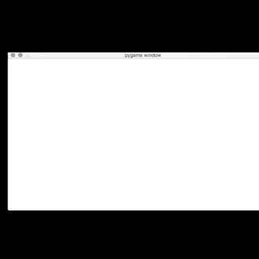

# pymaze

Maze generator and solver in python.

## generator

```sh
$ python generator.py
```



The goal is to display the maze generation in real time. I did not want to use recursion, so I have chosen to implement backtrace algorithm using a simple stack structure.

The program is composed of an infinit loop that build the maze, cell by cell at each round.
For each movement, the program check it can move from the current to the next position. If it can't (it reached an edge, or a wall) it tests another move.
If the current position is a dead end (no more movement is possible), the program pops the stack until it finds a position from which it can move again.

The program uses `pygame` to display the maze in real time.
It also uses `numpy` to store the maze data in a local file (`./maze`)

## display

```sh
$ python display.py
```

It opens the `maze` file and displays the saved maze.
The green plot represents the starting point.
The blue plot represents the most distant point from the start.

## Sources

* https://scipython.com/blog/making-a-maze/
* http://www.migapro.com/depth-first-search/
* https://www.algosome.com/articles/maze-generation-depth-first.html
* http://programarcadegames.com/index.php?lang=en&chapter=array_backed_grids
